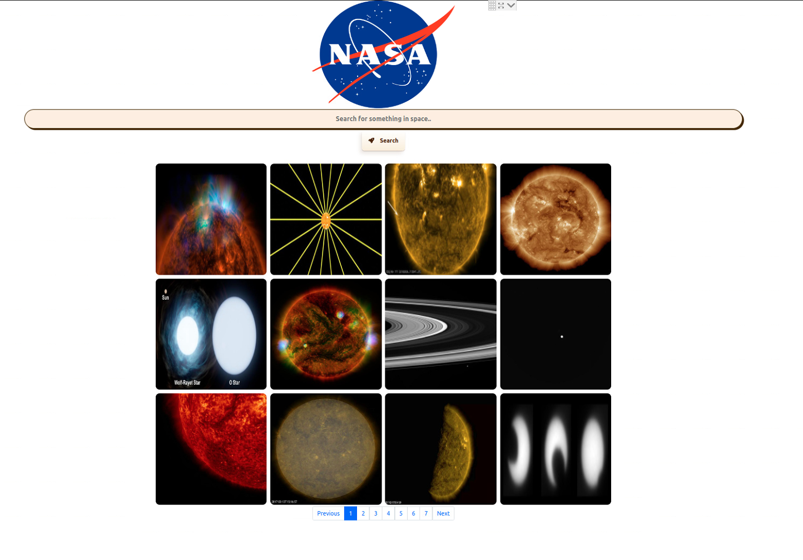

This application searches for data in the form of images from a web API. This involved making a get request via Axios and filtering the reaults to return and deplay the images.

I mainly focussed on the functionlity of this rather than the styling, and implemented some additianl funtionality like pagination

 "Screenshot of UI"
